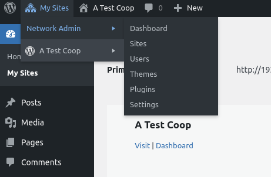

# Server Setup and Coop Install

## Prerequisites

The setup assumes you are familiar with the Linux command line, as well as with the MYSQL command line admin tool. Also, that you have root access to your server and the server is not running other web services. For example, make sure Apache is not installed. You can remove it on Debian systems with:
	
	sudo apt remove apache2

This guide takes you through each of the steps and shows the necessary terminal commands, hopefully providing all the necessary context. If you follow the setup as described here, everything should go well. The choice was made to do this instead of create an install script for several reasons: 1) creating an install script is tricky and needs to be maintained; 2) running through all the steps makes it clear what is going on, so that individual steps can be adjusted or adapted; 3) following from reason 2, if software or server environments change, having the steps laid out (rather than hidden behind a script and it's UI) will make future adjustments easier. However, for some of the trickier steps, we've created individual scripts for appending or editing config files, so that in all, only simple command line .. uh ... commands are needed.

The installation process involves the following main steps:

1. Installing services that are provided by the OS distribution
2. Downloading the Coop Publications Software
3. Downloading and installing runtime software applications: SOLR, Wordpress
4. Configuring the various software to work together.


## Server Requirements

Linux server. The install instructions were tested with the following specs, but others may also work.

* 4 core CPU, 4GB ram, and 80GB disk
* Ubuntu Server 24.04 LTS
* nginx 1.24.0 (version that ships with Ubuntu)
* PHP 8.3 fpm (version that ships with Ubuntu)
* MYSQL (version that ships with Ubuntu)
* Open JDK (version that ships with Ubuntu)

As you can see, really all you need is Ubuntu 24.04 LTS, and the rest are all provided by the distribution.


## Install services provided by the OS distribution

Login to your server using your main login, especially a login you use for managing website files. Needless to say, do not login as root directly.

Use your system's package manager to install services. These are the versions the PSC has tested and uses on its server, you may be able to use newer versions with little or no change. On Ubuntu, the commands are as follows:

	sudo apt install nginx
	sudo apt install php8.3-fpm
	sudo apt install php8.3-mysqli
	sudo apt install php8.3-xsl
	sudo apt install php8.3-mbstring
	sudo apt install php8.3-gd
	sudo apt install php8.3-zip
	sudo apt install php8.3-xml
	sudo apt install php8.3-curl
	sudo apt install mysql-server
	sudo apt install default-jdk
	sudo apt install unzip
	sudo apt install nano

Some notes: the default-jdk is the GNU version of JAVA, and is required by SOLR. Unzip will be needed for the Solr install process. We also added nano to the list, since it's handy to have a better command line text editor.


## Install the Coop Software Package

The best way to get the software is to use git from the command line; you can checkout our software repository and keep your software up-to-date. 

Our github repository is at: https://github.com/mhsdeveloper/psc-full

You need to know your developer username; type "whoami" to see it. 


### To Use git:

1. use the command to install git:

	```
    sudo apt install git
	```

2. create the proper directory structure and ownership/permissions; change your-user-name-here to reflect your actual username:

	```
    sudo mkdir /psc
    sudo mkdir /psc/www
    sudo mkdir /psc/www/html
    sudo chown -R your-user-name-here /psc
    sudo chgrp -R your-user-name-here /psc
	sudo chmod -R g+w /psc
	```

3. Download the software: change to the correct directory, setup git, and then checkout our package with these commands:

	```
    cd /psc/www/html
    git init
	git branch -m main
    git checkout git@github.com/mhsdeveloper/psc-full.git
	```


## SOLR


### Download and install

Apache Solr is an open-source search engine that we use for searching documents and browsing metadata. It is probably the best sofware these is for these features, which is why we chose to integrate it with our system despite the added complexity of installation.

Our setup was tested with Solr version 8.11.3. It is not the latest, but it is the most stable version of the 8 series. Download Apache SOLR from [SOLR's website](https://solr.apache.org/download) The procedure is to download the zip file to our install folder; then unpack a script "bin/install_solr_service.sh" from within the zip file, and use that script to unpack the rest of the archive and install. For convenience we've included the install script for 8.11.3, so you can just use the following commands to download and install:

	cd /psc/www/html/install
	wget --trust-server-names https://www.apache.org/dyn/closer.lua/lucene/solr/8.11.3/solr-8.11.3.zip?action=download
	sudo bash ./install_solr_service.sh solr-8.11.3.zip

If Solr starts but fails it's ok, we're not done yet; just press CTRL-C and continue with these instructions.

If you have different installation needs, read SOLR's documentation for installing as a service; see their page "Taking Solr to Production".


### Configure SOLR

Set the password for the solr user; choose a password and keep it somewhere safe:

	sudo passwd solr

Create the initial solr storage collection:

	sudo whoami
	su solr -c "/opt/solr/bin/solr create -c publications"

If asked, entered your main password for the sudo whoami command. Use the solr user password for the second command. For serious Linux users: we run the sudo whoami command to make sure the installer has recently "sudo'd". This effectively separates the two passwords, which can otherwise be very confusing.

Solr stores its config, index, and other data in /var/solr/data/publications/. In that folder, we need to remove the managed-schema and copy over our own schema for better performance:

	sudo rm /var/solr/data/publications/conf/managed-schema
	sudo cp /psc/www/html/install/server-configs/schema.xml /var/solr/data/publications/conf/

Run our configuration script, which which take care of some trickier changes to solrconfig.xml:

	cd /psc/www/html/install
	sudo bash ./scripts/configure-solr.sh

Restart SOLR:

	sudo service solr restart


### IMPORTANT SECURITY NOTE, FIREWALL SETUP

You should make sure your host/network is blocking external access to port 8983, which SOLR uses. That way, only the server itself (PHP) can access SOLR directly, but the outside world cannot. THIS IS A VITAL STEP: leaving the Solr Admin UI and API open means that anyone that happens upon your site could change or delete your data. It may also expose your server to vulnerabilities via Solr.  It is also possible to configure your OS to block that port if your host ISP does not offer this service.

To see if you're host is blocking that port, try to connect by using your browser to go to your server's url on port 8983. For example, if you server's domain name is mywebsite.org, you would enter this url: http://www.mywebsite.org:8983 If you see the Solr Admin interface, then the port is not being blocked, and you need to configure your firewall.

The following is optional, use these if your host does not block port 8983. We can use ufw to create a firewall in software:

	sudo apt install ufw
	sudo ufw enable

Then, to block access to Solr from the outside world:

	sudo ufw deny 8983


## Install Wordpress

We use Wordpress to manage user login, and to serve the static pages, like the homepage and about pages, things like that. See separate documentation for using a different CMS as your frontend.

We've included the most recent version of Wordpress to be tested with the Coop software. Unpack Wordpress, and move it to the main server html directory:

	cd /psc/www/html/install
	unzip wordpress-6.6.1.zip
	mv wordpress/* ../


## Connecting all the pieces

Lastly, we need to configure all the parts of the system.


### Setup web server user

We'll add the various web-services users to your user group. Nginx and PHP-fpm both run as the user www-data, so we add them to your user group:

    sudo usermod -a -G your-user-name-here www-data


### Configure PHP

Run our configuration script to append the necessary settings to the php.ini file:

	cd /psc/www/html/install/scripts
	sudo bash ./configure-php.sh

Restart php:

	sudo service php8.3-fpm restart


### Configure Nginx

The main web service is Nginx, which listens to all incoming traffic. We configure it to connect to each of the components of the system. 

First, find the file install/server-configs/wpmu.conf. Change the line after the comment "EDIT HERE", the line reads:

	server_name  mydomain.org www.mydomain.org;

Change each occurance of "mydomain.org" to your actuall domain name. Note there is a version with and without the leading "www." If you are just using an IP or localhost, don't use the www. version.

Run our configuration script, which assumes you're using php 8.3-fpm, as in the above. If you're using a different version, edit the nginx/sites-available/wpmu.conf to reflect which php (you'll see php8.3 mentioned, change that. You can discover which php you're running with: sudo apt list --installed php* )

	cd /psc/www/html/install/scripts
	sudo bash ./configure-nginx.sh

If you are using SSL, please read ssl-in-nginx.md for further require steps.

Restart Nginx:

	sudo service nginx restart


### Configure MYSQL

Run the mysql install script and follow our recommended answers to the install questions:

	sudo mysql_secure_installation

Answer the question as follows:

	Validate password component: No
	Remove anonymous user: Yes
	Disallow remote root login: Yes
	Remove test database: Yes
	Reload privileges: Yes


### Copy and edit environment files

Copy server-env.php and environment.php to /psc/www

	cp /psc/www/html/install/server-configs/server-env.php /psc/www/
	cp /psc/www/html/install/server-configs/environment.php /psc/www/
	cp /psc/www/html/install/server-configs/apikeys.php /psc/www/
	cp /psc/www/html/install/server-configs/wp-config.php /psc/www/html/

Run our script to configure the server environment.

	bash /psc/www/html/install/scripts/configure-env.sh

If you use a testing server and/or a virtualbox for a local testing installation, also change these constants in the server-env.php file:

	COOP_TEST_IP, LOCAL_TEST_IP


### Configure Wordpress

Open you browser and point it to your website. You should see a Welcome to Wordpress page, which will outline the information you need. This mostly amounts to the name of the database and user and password you created above. Wordpress may ask you to create a wp-config.php file that should go at the root of your website, sibling to the wp-admin and wp-content folders.

Next, let's move our Coop-specific Wordpress plugin and theme into place:

	cd /psc/www/html/install
	cp -r wpfiles/* /psc/www/html/wp-content/

Next we need to enable the Multisite feature of Wordpress. This allows you to have a central site for your entire publishing system, and separate individual sites for each project or publication. Open up the wp-config.php file that was create, and add these lines ABOVE the comment /* That's all, stop editing! Happy publishing. */:

	/* Multisite */
	define( 'WP_ALLOW_MULTISITE', true );
	/* more code here */


Login to Wordpress and go to the "Tools" menu, "Network Setup". Follow the instructions for creating a network; you will have to and a few more lines of code by the comment /* more code here */; Wordpress will instruct you. 

Logout and login to see the changes.

Lastly, we need to enable our plugin and theme to be available to all sites in the Wordpress multisite install. Login to Wordpress, and at top corner under "My Sites", find "Network Admin" and "Themes". In the page that loads, make sure the "psc1" theme is enable for the network.



Do the same for the psc plugin un the "Plugins" menu.

#### Some other recommended steps

We recommend disabling most of the dashboard items in Wordpress. From the dashboard, click on "Screen options" near the top right. Uncheck everything except "Coop Tools"; leave that checked as it provides links to Coop-specific features.


### Setup initial projects/editions directory and sample project/edition


Edit .env file for Laravel in html/mhs-api/.env


## Quick Content Tutorial